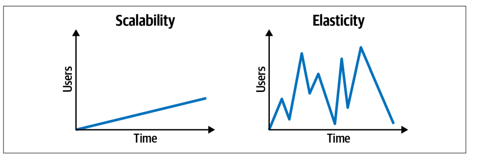

# Software engeneering concepts

## 1. Dependency inversion vs dependency injection

#### 5 years old explanation

You want to build a LEGO car, but you don’t have wheels. Instead of making the wheels yourself, your mom gives you the wheels, and you just attach them. Now your car can move!

Now, what if you have different types of wheels? Big wheels, small wheels, even futuristic hover wheels!

Instead of your LEGO car needing a specific type of wheels, you say:
"I don't care what kind of wheels they are, as long as they can spin!"

### Dependency Injection:

A class receives its dependencies from the outside (they are instantiated elsewhere and injected).
Promotes flexibility and testability.

#### Example:

```typescript
// Dependency injection (Logger)
class Logger {
  log(message: string): void {
    console.log("Log:", message);
  }
}
// Class that depends on Logger
class UserService {
  private logger: Logger;

  constructor(logger: Logger) {
    this.logger = logger;
  }

  createUser(name: string): void {
    this.logger.log(`User ${name} created.`);
  }
}
// Dependency is instantiated outside and injected
const logger = new Logger();
const userService = new UserService(logger);
userService.createUser("John Doe");
```

### Dependency Inversion:

High-level modules depend on abstractions (interfaces), not concrete implementations.
Decouples classes by relying on interfaces, not direct instances.
Dependency Inversion adds more boiler code (more code to maintain), and the code becomes harder to navigate

#### Example:

```typescript
// Dependency inversion (Logger)
interface ILogger {
  log(message: string): void;
}

// Low-level module (implementation of ILogger)
class ConsoleLogger implements ILogger {
  log(message: string): void {
    console.log("Console:", message);
  }
}

// High-level module depends on the interface, not a concrete class
class UserService {
  private logger: ILogger;

  constructor(logger: ILogger) {
    this.logger = logger;
  }

  createUser(name: string): void {
    this.logger.log(`User ${name} created.`);
  }
}

// Inject any implementation of ILogger
const logger = new ConsoleLogger();
const userService = new UserService(logger);
userService.createUser("Jane Doe");
```

## 2. Synchronous vs Asynchronous

#### 5 years old explanation

Synchronous is like waiting in line for ice cream. You have to wait for the person in front of you to finish before you can get yours.

Asynchronous is like ordering a pizza. You call and place your order, but while waiting for the pizza to arrive, you can play, watch TV, or do something else. When it's ready, they bring it to you.

### Synchronous:

Synchronous operations happen one after another, in a blocking manner. Each task must complete before the next one begins. This is common in sequential programming where each step depends on the previous step finishing.

### Asynchronous:

Asynchronous operations allow tasks to happen independently and not block the execution of the program. Instead of waiting, the program can continue running other tasks while waiting for the operation to complete.

### Trade-offs Between Synchronous and Asynchronous

| **Factor**          | **Synchronous**                                               | **Asynchronous**                                                                         |
| ------------------- | ------------------------------------------------------------- | ---------------------------------------------------------------------------------------- |
| **Execution Order** | Tasks run sequentially, one after another.                    | Tasks can run independently without waiting.                                             |
| **Performance**     | Slower for tasks that involve waiting (e.g., I/O operations). | More efficient for handling multiple tasks concurrently.                                 |
| **Complexity**      | Easier to understand and debug.                               | More complex due to callbacks, promises, and concurrency issues.                         |
| **Blocking**        | Blocks execution until a task is completed.                   | Does not block; other tasks can continue running.                                        |
| **Error Handling**  | Errors are handled sequentially, making debugging simpler.    | Requires handling multiple possible execution paths (e.g., promise chains, async/await). |
| **Use Case**        | Best for tasks that must happen in order, like calculations.  | Best for tasks like API calls, file I/O, or user interactions.                           |
| **Resource Usage**  | Can lead to inefficiency if waiting on slow operations.       | Uses resources efficiently by not blocking the main thread.                              |
| **Scalability**     | Harder to scale due to blocking nature.                       | More scalable, especially for high-load applications.                                    |

## 3. Orchestrated vs Coordination

#### 5 years old explanation

Orchestrated is like a conductor leading an orchestra. The conductor tells each musician when to play so that everything happens in a structured way.

Coordination is like a group of friends playing music together without a conductor. They listen to each other and adjust as they go, but no one is in complete control.

### Orchestrated:

In an orchestrated system, there is a central authority that controls and directs the flow of tasks. Each component follows predefined instructions, much like musicians following a conductor. This approach ensures a structured, predictable sequence of actions.

- example: aws step function

### Coordination:

In a coordinated system, components work together without a central authority dictating their actions. Each part is aware of others and adjusts dynamically based on communication and shared state.

- Orchestration a central service controls the work flow, it easy to track workflows but adds a single point of control (and potential failure).
- Choreography Services react to events and determine their next step independently (like event-driven architectures) scales better and reduces dependencies but can become chaotic without clear event contracts.

## 4. Elasticity vs Escalability

- Escalability how much the service can handle simultaneos users.
- Elasticity how much it can handle an explosion of users
  

## 5. Static coupling vs Dynamic coupling

static coupling describes how services are wired together _compilation phase_, whereas dynamic coupling
describes how services call one another at runtime.
it is important to know that a database an SQS queue are static coupling components, when we call the SQS that is a dynamic coupling

## 6. CAP Theorem (Consistency, Availability, Partition Tolerance)

- **Consistency** means all nodes in a distributed system see the same data at the same time.
- **Availability** means every request gets a response, even if some of the data might not be up-to-date.
- **Partition Tolerance** ensures the system continues to function even if network partitions occur between nodes.

## 7. ACID vs BASE (CAP Theorem related)

- **ACID** refers to the properties (Atomicity, Consistency, Isolation, Durability) of traditional databases ensuring reliable transactions.
- **BASE** (Basically Available, Soft state, Eventually consistent) is a model used in NoSQL systems where availability is prioritized over consistency.

## 8. Blue/Green Deployment vs Canary Deployment

### **Blue/Green Deployment**

involves running two environments (blue and green) and switching traffic between them to minimize downtime during updates.

- When minimal downtime is critical.
- Major application updates requiring a quick rollback.
- Ensuring a stable environment before switching traffic.

### **Canary Deployment**

gradually rolls out changes to a small subset of users before deploying to everyone, allowing for early detection of issues.

- When testing updates with real users but in a controlled manner.
- When monitoring performance and errors in a production-like environment.
- When reducing risk of major failures with incremental rollout.

## 9. Monolithic Event-Driven and Microservices Event-Driven:

- Monolithic Event-Driven: Inside a monolith, you can implement event-driven behavior to reduce tight coupling, making your app more scalable, though it's still running as a single process.
- Microservices Event-Driven: In microservices, each service is independent and communicates through events, enabling decoupling and better scalability across machines or containers.

## 10. Reliability, Fault Tolerance, and Redundancy:

- Reliability: the system's ability to perform its intended functions without failure or errors over a specified period of time.
- Fault Tolerance: refers to how well the system can detect and heal itself from a problem, i.e. disable a function, revert to a different mode, switch to a different server.
- Redundancy: This redundancy is provided by our backup server which essentially "shadows" the contents of a server. We don't need this server, but it only comes into play if our primary server fails. Only by having this redundancy, are we able to have fault tolerance. In this case, the second server is simply a backup. But, what if we had two servers that were both active? This would be called active-active redundancy.

## 11. Throughput and Latency:

- Throughput: refers to the amount of data or operations we can handle over some period of time. The throughput of a client making requests to a server would be measured through the number of requests per second, Database(queries/second),Network(bytes/second).
- Latency: refers to the delay between the client making the request and the server responding to that request.

## 12. The Open Graph Protocol (OGP):

By embedding specific meta tags in the <head> of an HTML document, you can control how your content appears when shared on platforms like Facebook, LinkedIn, Twitter (with some differences), and others.

#### Example:

```html
<meta property="og:title" content="My Awesome Website" />
<meta
  property="og:description"
  content="This is a description of my awesome website."
/>
<meta property="og:image" content="https://example.com/image.jpg" />
<meta property="og:url" content="https://example.com" />
<meta property="og:type" content="website" />
<meta property="og:site_name" content="MySite" />
```

## 13. Compiled vs interpreted languages:

#### 5 years old explanation

Imagine you're reading a storybook. In one case, the story is written in a special way that the book is turned into a picture book, and you can read it right away—like magic! This is similar to a compiled language. Before you can play with it, someone (a compiler) reads the whole book and turns it into something you can use directly.

In another case, you have a person reading the story to you one page at a time. Each time you want to hear a part of the story, the reader (the interpreter) reads it aloud to you, page by page, without turning the whole book into something you can read on your own. This is like an interpreted language. It reads and understands the story one part at a time while you play with it!

## 14. TCP vs UDP

#### 5 years old explanation

Imagine you are sending letters to your friend:

- TCP (Like sending a letter with tracking)
  When you send a letter, you make sure your friend gets it. If the letter gets lost, you send it again. Your friend also tells you, "Hey, I got your letter!" so you know it arrived safely. This is like TCP—it makes sure all messages are delivered in the right order and without mistakes.
- UDP (Like throwing paper airplanes)
  Instead of mailing a letter, you throw paper airplanes with messages. Some might land perfectly, but others might get lost or crumpled. You don’t wait for your friend to say, "I got it!" You just keep throwing. This is like UDP—it's super fast, but messages might get lost.

### TCP

- It sends the data _IN ORDER_
- Ensures delivery, if a packet fails it resends it
- slower
- HTTP, WS, SMTP

### UDP

- Not Reliabile
- Not in order
- ALOT faster
- streaming data, gaming

## 15. What is soft delete:

Add a deleted_at, and on delete do not remove, just register the deleted_at

## 16. Optimistic Locking vs Pessimistic Locking

### Pessimistic Locking:

- locks the data (like database row) whe you read it, no one else can read or update that row
- you can imagin that this makes cost, because everyone else will need to wait till you finish
- Safer when high concurrency is expected
- Avoids race conditions.
- Risk of deadlocks. Can reduce performance due to waiting and blocking.

### Optimistic Locking:

- when you read a row you will have like a version, when you are going to save the update it checks if the version is the same,
  if it is the same you can, if another query raced and changed the data before you the version changed and your query needs to redo.
- Reads data without locking.
- On save, checks if data has changed.
- If changed, throws error or retries.
- Requires conflict handling logic.

## 17. what are deadlocks:

- A deadlock is a situation where two or more operations are stuck waiting for each other, and none can proceed. It’s like a circular wait where everyone is holding something the other one needs.
- like if you have a database and you have an operation that does something, but is waiting for the other one doing the same operation to finish, but this other is waiting for your operation to finish.
- it can happen in integration tests, if you are not running in band, and tests are using same db and ur tests are waiting for the other one to finish they might end up waiting for each other
